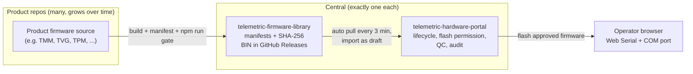

# Telemetric Firmware Ecosystem — Big Picture

Canonical governance lives in `ai-collaboration-vault/03_Rules/telemetric-firmware-ecosystem.md`
(adopted 2026-08-26). This note is the visual overview for orientation.

## Shape of the ecosystem

- **1** web portal repository: `telemetric-hardware-portal`
- **1** central firmware library repository: `telemetric-firmware-library`
- **N** product firmware repositories (one per independently versioned product) — this list grows constantly
- **M** supporting tool repositories (scanners, backend servers, product web tooling)

## Who owns what

| Question | Owner |
|---|---|
| What source produced the firmware? | Product repository commit |
| What exact bytes define the artifact? | Firmware Library release asset + manifest SHA-256 |
| Is this firmware allowed for this unit today? | Local Hardware Portal |
| Did the unit pass QC? | Local Hardware Portal append-only QC record |
| Which COM port? | Operator browser on that laptop |

## Flow (mandatory, no shortcuts)

1. Develop and test in the product repository.
2. Produce BIN + manifest, run `npm run gate` in the library.
3. Push manifest, publish BIN as a GitHub Release asset.
4. Portal auto-syncs, validates (schema, SHA-256, size, compatibility), imports as `draft`.
5. Human review promotes to `approved` / `recommended` in the portal.
6. Flash via Web Serial. QC is separate. Flash success is never QC PASS.

## Where this vault fits

This vault (`obsidian-portal-hardware`) is the **registry**: it answers
"where is it on disk and what is its GitHub name" for every repository,
especially the many product firmware repos. It does not restate the governance
rules; it links to them.
